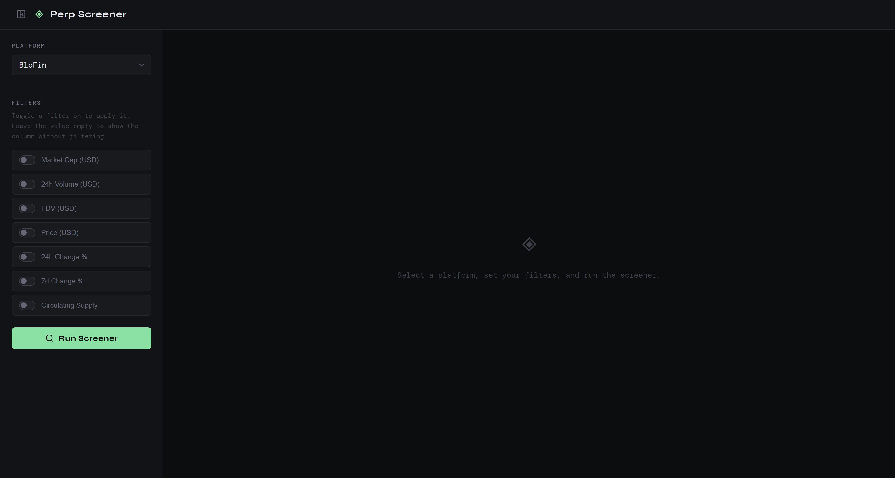
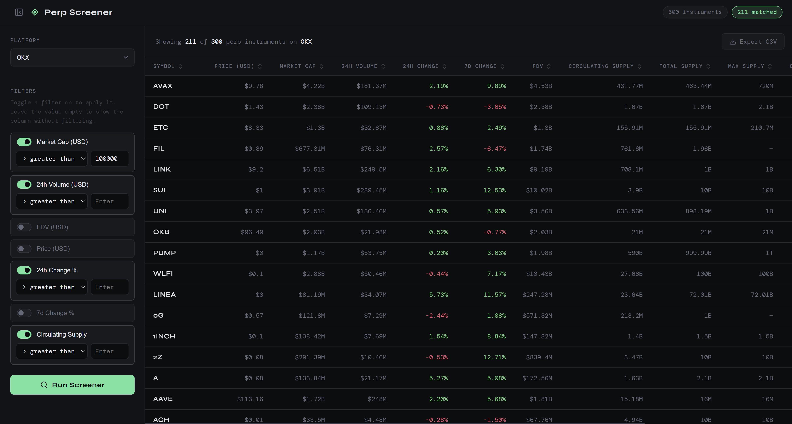

# Perp Screener

Screen perpetual futures tokens across exchanges, cross-referenced with CoinGecko market data, with toggleable filters.

## Demo

### Landing Page


### Search Results



```
perp-screener/
├── backend/       FastAPI app (containerized, deploy to Render)
└── frontend/      React app (deploy to Vercel or Netlify)
```

---

## Backend setup

### Running locally

```bash
cd backend
cp .env.example .env          # add your CoinGecko API key
pip install -r requirements.txt
uvicorn main:app --reload --port 8000
```

### Running with Docker

```bash
cd backend
docker build -t perp-screener-backend .
docker run --env-file .env -p 8000:8000 perp-screener-backend
```

### Deploying to Render (free tier)

1. Push this repo to GitHub
2. Go to render.com → New → Web Service
3. Connect your GitHub repo, set the root directory to `backend/`
4. Runtime: Docker
5. Add environment variable: `COINGECKO_API_KEY=your_key`
6. Deploy — Render gives you a URL like `https://your-app.onrender.com`

> Note: Render's free tier spins down after 15 minutes of inactivity. The first request after that takes ~30 seconds to cold start. This is fine for low usage.

---

## Frontend setup

### Running locally

```bash
cd frontend
cp .env.example .env          # set REACT_APP_API_URL=http://localhost:8000
npm install
npm start
```

### Deploying to Vercel (free tier)

1. Push to GitHub
2. Go to vercel.com → New Project → import your repo
3. Set root directory to `frontend/`
4. Add environment variable: `REACT_APP_API_URL=https://your-app.onrender.com`
5. Deploy

---

## Adding a new exchange

1. Create `backend/adapters/yourexchange.py` with a `fetch_instruments()` function
   that returns a list of dicts in this shape:
   ```python
   {
     "symbol":        str,    # base currency e.g. "BTC"
     "contract_size": float,
     "max_leverage":  float,
     "tick_size":     float,
   }
   ```
2. Register it in `backend/adapters/__init__.py`:
   ```python
   from adapters.yourexchange import fetch_instruments as yourexchange_fetch
   ADAPTERS["YourExchange"] = yourexchange_fetch
   ```

The frontend dropdown picks it up automatically — no other changes needed.

---

## API endpoints

| Method | Path            | Description                                  |
|--------|-----------------|----------------------------------------------|
| GET    | `/api/platforms`| Returns list of available exchange platforms |
| POST   | `/api/filter`   | Main screener endpoint                       |

### POST /api/filter

Request body:
```json
{
  "platform": "BloFin",
  "filters": {
    "market_cap":  { "condition": "gt", "value": 500000000 },
    "change_24h":  { "condition": "gt", "value": 5 }
  }
}
```

- Filters not included in the request are ignored entirely
- `condition` is `"gt"` (greater than) or `"lt"` (less than)
- If a token is missing data for an active filter field, it is excluded

Response:
```json
{
  "platform": "BloFin",
  "total_instruments": 312,
  "matched": 18,
  "results": [ ... ]
}
```
